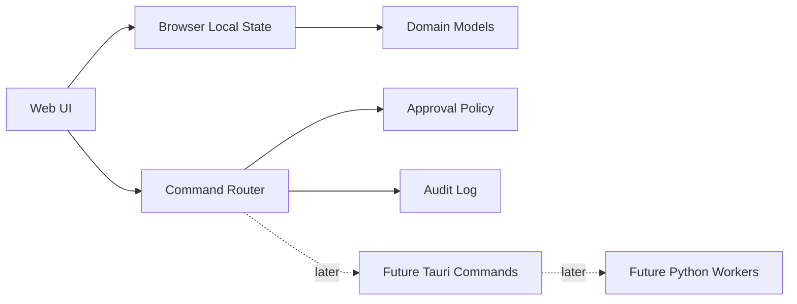

# Architecture

## Current State

This repository now contains a dependency-free local web application with browser-local state, Project OS docs, command routing, approvals, workflow state, and an agent platform registry. The next architecture step is a Tauri desktop shell that exposes safe native capabilities through explicit allowlisted commands, followed by a Python worker layer for read-only repo analysis and agent adapters.

## Target Foundation

## Boundaries

- `src/app.js`: Browser UI composition, persisted local state, audit log, Project OS workspace, and interaction handlers.
- `src/data.js`: Seed product data, Project OS document registry, and agent platform registry.
- `src/domain-js`: Dependency-free command routing and approval policy modules.
- `src/styles.css`: Global design system and responsive operations UI styling.
- `scripts`: Local dev server and static build scripts.
- `docs`: Product OS, plans, logs, risks, workflows, and release records.

## Command Routing Model

Commands are classified before execution:

- `known-safe`: Read-only or product-internal actions that can be handled deterministically.
- `approval-required`: Destructive, credential, production, external-account, or dependency actions.
- `intake-required`: Ambiguous or unsupported requests that need clarification.
- `blocked`: Requests that violate safety policy.

The first web version demonstrates this routing locally. It must not execute shell commands.

## Approval Model

Approval records should capture:

- Action title and summary.
- Risk level.
- Requested by.
- Target system or files.
- Proposed command or operation.
- Required rationale.
- Decision state.
- Audit trail entry.

## Future Integration Path

1. Complete browser-local state and Project OS workspace polish.
2. Add agent platform capability profiles and room assignment.
3. Add Tauri desktop shell with read-only allowlisted commands.
4. Add Python worker process for repo analysis and agent adapters.
5. Add approval-gated command execution.
6. Add provider adapters, local model fallback, signed releases, and exportable audit reports.

