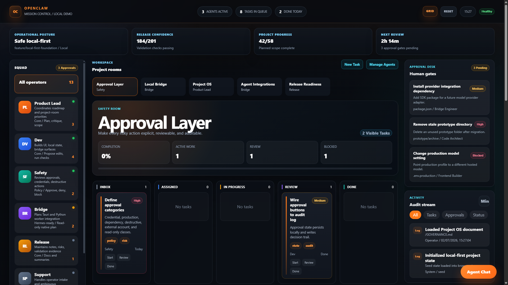

# OpenClaw Mission Control

OpenClaw Mission Control is a local-first operations console for coordinating software work across agents, project rooms, tasks, approvals, documentation, and release readiness.

It is designed for teams that want a practical command center for project flow and local-first automation planning without giving browser code direct access to shell commands or sensitive machine state.



## Highlights

- Agent roster with roles, capabilities, status, and task counts.
- Project Rooms board for Approval Layer, Local Bridge, Project OS, Agent Integrations, and Release Readiness.
- Kanban-style task flow across Inbox, Assigned, In Progress, Review, and Done.
- Persistent browser-local state using `localStorage`.
- Approval queue for risky work categories.
- Deterministic command-routing demo with safe, approval-required, intake-required, and blocked outcomes.
- Project OS workspace for architecture, roadmap, workflow, risks, and release documents.
- Live activity feed backed by local audit events.
- Planned path toward Tauri desktop packaging and a Python worker layer.

## Core Concepts

OpenClaw Mission Control is organized around a small product model:

- Workspaces hold rooms, boards, agents, approvals, documents, and activity.
- Project Rooms group work around operational objectives.
- Tasks move through board columns and can be assigned to agents or human reviewers.
- Agents represent capability-bounded roles, not unrestricted automation authority.
- Approvals capture human decision points before risky work proceeds.
- Activity Events form the local audit trail.

See [docs/object-model.md](docs/object-model.md) for the full model.

## Running Locally

```bash
npm run dev
```

Open `http://127.0.0.1:5173`.

The app currently has no runtime dependencies beyond Node.js.

## Validation

```bash
npm run check
npm run build
npm run validate
```

## Deploying

This project can be deployed to Vercel as a static site. See [docs/vercel.md](docs/vercel.md) for build settings and operational guidance.

`npm run check` validates JavaScript syntax. `npm run build` copies the static app to `public-dist/` and writes an archived build under `build-output/`. `npm run validate` runs both checks in sequence.

## Configuration

Copy `.env.example` if you need to document local settings for a future gateway or desktop build. The current static prototype does not require secrets or environment variables.

## Documentation

- [Documentation Index](docs/README.md)
- [Architecture](ARCHITECTURE.md)
- [Design](DESIGN.md)
- [Governance](GOVERNANCE.md)
- [Roadmap](ROADMAP.md)
- [Workflows](WORKFLOWS.md)
- [Security Model](docs/security-model.md)
- [Local Gateway](docs/local-gateway.md)
- [Deployment](docs/deployment.md)
- [Vercel Deployment](docs/vercel.md)
- [API Roadmap](docs/api-roadmap.md)

## Safety Model

- Browser code does not execute shell commands.
- Command routing is local and demonstrative.
- Destructive, credential, production, dependency, billing, and external-account operations are modeled as approval-gated or blocked.
- Native capabilities are planned for a future Tauri layer with explicit allowlisted commands.
- Python workers are planned as bounded local processes behind the native bridge.

## Roadmap

See [ROADMAP.md](ROADMAP.md) for the phased plan:

1. Real local product state.
2. Project OS workspace.
3. Agent platform registry and project rooms.
4. Tauri desktop shell.
5. Python worker layer.
6. Approval-gated local execution.
7. Provider and local model integrations.

## Contributing

See [CONTRIBUTING.md](CONTRIBUTING.md), [SECURITY.md](SECURITY.md), and [CODE_OF_CONDUCT.md](CODE_OF_CONDUCT.md).

## License

MIT. See [LICENSE](LICENSE).